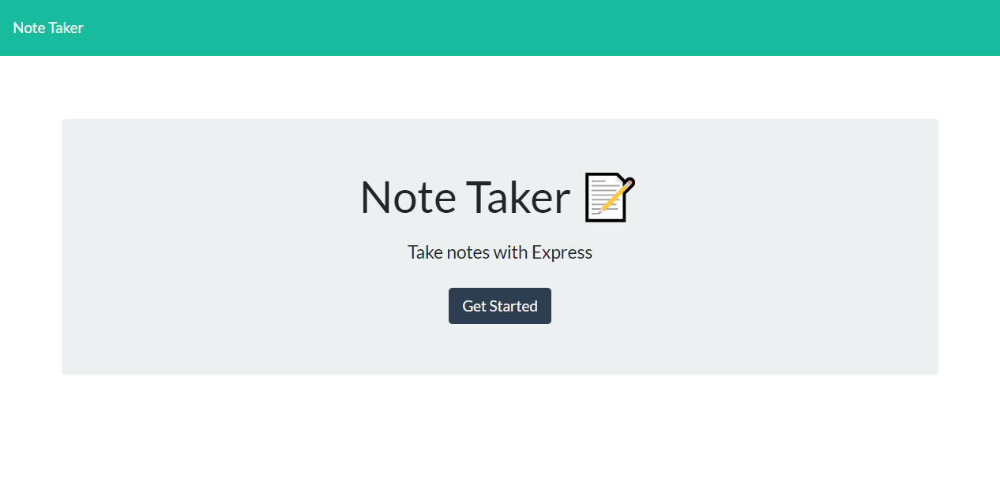

# Note-Taker

## Table of Contents

1. [Description](#Description)
1. [Installation](#Installation)
1. [Deployed Instance](#Deployed)
1. [Questions](#Questions)
      
## Description

This app allows you to write and delete simple notes.

## Installation

Clone the repository and run `npm install` inside of its directory.

## Deployed Instance
This [link](todo) will take you to a deployed instance of the app.

## Questions

Github Account: [rrrbbbsss](https://github.com/rrrbbbsss)
